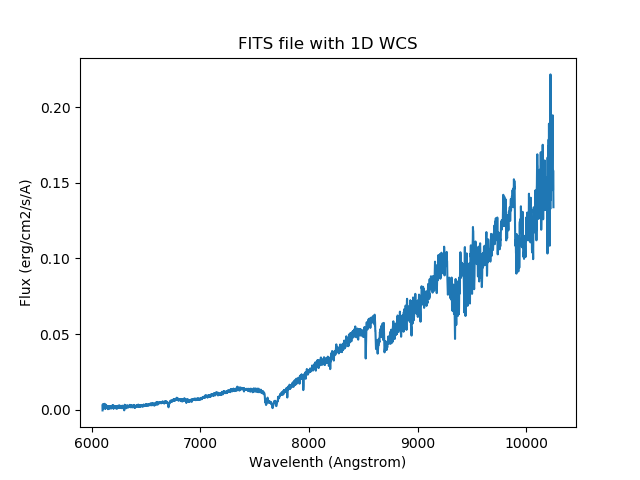

*************************************************
Loading and Defining Custom Spectral File Formats
*************************************************

Loading From a File
-------------------

Specutils leverages the astropy io registry to provide an interface for conveniently
loading data from files. To create a custom loader, the user must define it in
a separate python file and place the file in their ``~/.specutils`` directory.

Loading from a FITS File
------------------------
A spectra with a *Linear Wavelength Solution* can be read using the ``read``
method of the :class:`~specutils.Spectrum1D` class to parse the file name and
format

.. code-block:: python

  import os
  from specutils import Spectrum1D

  file_path = os.path.join('path/to/folder', 'file_with_1d_wcs.fits')

  spec = Spectrum1D.read(file_path, format='wcs1d-fits')

This will create a :class:`~specutils.Spectrum1D` object that you can manipulate later.

For instance, you could plot the spectrum.

.. code-block:: python

  import matplotlib.pyplot as plt

  plt.title('FITS file with 1D WCS')
  plt.xlabel('Wavelength (Angstrom)')
  plt.ylabel('Flux (erg/cm2/s/A)')
  plt.plot(spec.wavelength, spec.flux)
  plt.show()

Creating a Custom Loader
------------------------

Defining a custom loader consists of importing the
`~specutils.io.registers.data_loader` decorator from specutils and attaching
it to a function that knows how to parse the user's data.  The return object
of this function must be an instance of one of the spectral classes
(:class:`~specutils.Spectrum1D`, :class:`~specutils.SpectrumCollection`,
:class:`~specutils.SpectrumList`).

Optionally, the user may define an identifier function. This function acts to
ensure that the data file being loaded is compatible with the loader function.

.. code-block:: python

    # ~/.specutils/my_custom_loader.py
    import os

    from astropy.io import fits
    from astropy.nddata import StdDevUncertainty
    from astropy.table import Table
    from astropy.units import Unit
    from astropy.wcs import WCS

    from specutils.io.registers import data_loader
    from specutils import Spectrum1D

    # Define an optional identifier. If made specific enough, this circumvents the
    # need to add ``format="my-format"`` in the ``Spectrum1D.read`` call.
    def identify_generic_fits(origin, *args, **kwargs):
        return (isinstance(args[0], str) and
                os.path.splitext(args[0].lower())[1] == '.fits')

    @data_loader("my-format", identifier=identify_generic_fits,
                 extensions=['fits'])
    def generic_fits(file_name, **kwargs):
        with fits.open(file_name, **kwargs) as hdulist:
            header = hdulist[0].header

            tab = Table.read(file_name)

            meta = {'header': header}
            wcs = WCS(hdulist[0].header)
            uncertainty = StdDevUncertainty(tab["err"])
            data = tab["flux"] * Unit("Jy")

        return Spectrum1D(flux=data, wcs=wcs, uncertainty=uncertainty, meta=meta)

An ``extensions`` keyword can be provided. This allows for basic filename
extension matching in the case that the ``identifier`` function is not
provided.

It is possible to query the registry to return the list of loaders associated
with a particular extension.

.. code-block:: python

    from specutils.io import get_loaders_by_extension

    loaders = get_loaders_by_extension('fits')

The returned list contains the format labels that can be fed into the ``format``
keyword argument of the ``Spectrum1D.read`` method.

After placing this python file in the user's ``~/.specutils`` directory, it
can be utilized by referencing its name in the ``read`` method of the
:class:`~specutils.Spectrum1D` class

.. code-block:: python

    from specutils import Spectrum1D

    spec = Spectrum1D.read("path/to/data", format="my-format")

.. _multiple_spectra:

Loading Multiple Spectra
^^^^^^^^^^^^^^^^^^^^^^^^

It is possible to create a loader that reads multiple spectra from the same
file. For the general case where none of the spectra are assumed to be the same
length, the loader should return a `~specutils.SpectrumList`. Consider the
custom JWST data loader as an example:

.. literalinclude:: ../specutils/io/default_loaders/jwst_reader.py
    :language: python

Note that by default, any loader that uses ``dtype=Spectrum1D`` will also
automatically add a reader for `~specutils.SpectrumList`. This enables user
code to call `specutils.SpectrumList.read <astropy.nddata.NDIOMixin.read>` in
all cases if it can't make assumptions about whether a loader returns one or
many `~specutils.Spectrum1D` objects. This method is available since
`~specutils.SpectrumList` makes use of the Astropy IO registry (see
`astropy.io.registry.read`).

.. _custom_writer:

Creating a Custom Writer
------------------------

Similar to creating a custom loader, a custom data writer may also be defined.
This again will be done in a separate python file and placed in the user's
``~/.specutils`` directory to be loaded into the astropy io registry.

.. code-block:: python

    # ~/.spectacle/my_writer.py
    from astropy.table import Table
    from specutils.io.registers import custom_writer

    @custom_writer("fits-writer")
    def generic_fits(spectrum, file_name, **kwargs):
        flux = spectrum.flux.value
        disp = spectrum.spectral_axis.value
        meta = spectrum.meta

        tab = Table([disp, flux], names=("spectral_axis", "flux"), meta=meta)

        tab.write(file_name, format="fits")

The custom writer can be used by passing the name of the custom writer to the
``format`` argument of the ``write`` method on the
:class:`~specutils.Spectrum1D`.

.. code-block:: python

    spec = Spectrum1D(flux=np.random.sample(100) * u.Jy,
                      spectral_axis=np.arange(100) * u.AA)

    spec.write("my_output.fits", format="fits-writer")

Reference/API
-------------
.. automodapi:: specutils.io.registers
    :no-heading:
