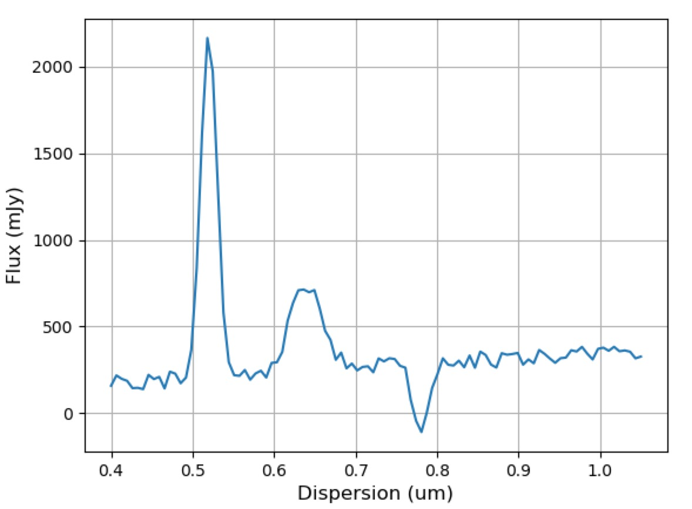
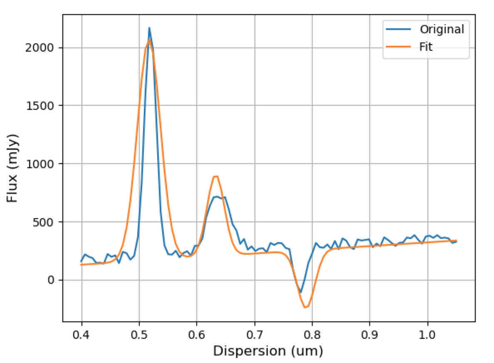

===================
Spectrum Fitting
===================

Specutils has the ability to fit the flux of a `~specutils.Spectrum1D` object.
The fit routine takes the `~specutils.Spectrum1D` object and a list of 
`~astropy.modeling.Model` that have initial guesses for each of the parameters. 

The internal functionality uses `~astropy.modeling.fitting` routines.  The flux
is extracted from the `~specutils.Spectrum1D` and is passed along with a 
compound model created from the model initial guesses.

Model Fitting
-------------

The first step is to create a set of models with initial guesses as the parameters. Even
better is to include a set of bounds for each parameter, but that is optional. 

.. code-block:: python

    >>> from astropy.modeling import models
    >>> from specutils import Spectrum1D
    >>> from specutils import fitting
    >>> import astropy.units as u
    >>> import numpy as np
    >>> np.random.seed(42)

For the purpose of the example, build a ``spectrum1d`` variable that will be used in the fitting:

.. code-block:: python

	>>> # Create the wavelength array
    >>> wave_um = np.linspace(0.4, 1.05, 100) * u.um

	>>> # Create the models
    >>> g1 = models.Gaussian1D(amplitude=2000*u.mJy, mean=0.52*u.um, stddev=0.01*u.um)
    >>> g2 = models.Gaussian1D(amplitude=500*u.mJy, mean=0.64*u.um, stddev=0.02*u.um)
    >>> g3 = models.Gaussian1D(amplitude=-350*u.mJy, mean=0.78*u.um, stddev=0.01*u.um)

	>>> # Create the flux array
    >>> base_flux = g1(wave_um) + g2(wave_um) + g3(wave_um)

	>>> # Create the `specutils.Spectrum1D` object.
    >>> flux_e1 = base_flux + 100*np.random.random(base_flux.shape)*u.mJy
    >>> spectrum1d = Spectrum1D(spectral_axis=wave_um, flux=flux_e1)

   Spectrum to be fit.

Now that there is a ``spectrum1d`` to fit, the real fitting setup must happen.  First create
the `~astropy.modeling.Model` to be used in the fitting routine.

.. code-block:: python

    >>> # Create the initial guesses
    >>> fg1 = models.Gaussian1D(amplitude=1900*u.mJy, mean=0.5*u.um, stddev=0.02*u.um, \\
                        bounds={'amplitude': (1700*u.mJy, 2400*u.mJy), \\
                                'mean': (0.3*u.um, 0.6*u.um), \\
                                'stddev': (0.001*u.um, 0.03*u.um)})
    >>> fg2 = models.Gaussian1D(amplitude=400*u.mJy, mean=0.63*u.um, stddev=0.03*u.um, \\
                        bounds={'amplitude': (200*u.mJy, 600*u.mJy), \\
                                'mean': (0.6*u.um, 0.7*u.um), \\
                                'stddev': (0.001*u.um, 0.03*u.um)})
    >>> fg3 = models.Gaussian1D(amplitude=-500*u.mJy, mean=0.79*u.um, stddev=0.02*u.um, \\
                        bounds={'amplitude': (-600*u.mJy, -300*u.mJy), \\
                                'mean': (0.7*u.um, 0.82*u.um), \\
                                'stddev': (0.001*u.um, 0.03*u.um)})

Now comes the actual fitting:

.. code-block:: python

    >>> # And... now we can do the fitting
    >>> fitted_models = fitting.fit_lines(spectrum1d, fg1+fg2+fg3)

The output of the fitting routine is another set of models whose parameters contain the result of the fit.
(There is a corresponding output model for each input model.)

   Original spectrum (blue) and fitted spectrum (orange).

.. automodapi:: specutils.fitting
