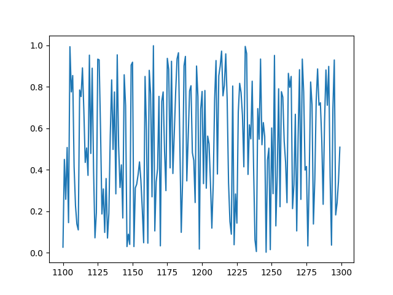
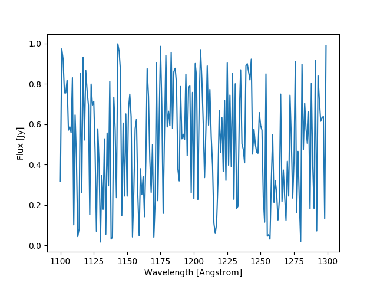

****************
Creating Spectra
****************

Quick Start
-----------

Generating a spectrum object is quite easy. The simplest way would look
something like

.. code-block:: python

    import numpy as np
    import matplotlib.pyplot as plt

    from specutils import Spectrum1D

    flux = np.random.sample(200)
    wave = np.arange(1100, 1300)

    spec1d = Spectrum1D(flux, spectral_axis=wave)

    plt.plot(spec1d.wavelength, spec1d.flux)

Spectra with units
------------------

It's also possible to include units. This can be done either by passing in
:class:`astropy.units.Quantity` arrays, or by specifying the units explicitly.

.. code-block:: python

    import numpy as np
    import matplotlib.pyplot as plt
    import astropy.units as u

    from specutils import Spectrum1D

    flux = np.random.sample(200)
    wave = np.arange(1100, 1300)

    # Specifying units explicitly
    spec1d = Spectrum1D(flux, spectral_axis=wave, unit=u.Jy, spectral_axis_unit=u.AA)

    # Using astropy quantities
    spec1d = Spectrum1D(flux * u.Jy, spectral_axis=wave * u.AA)

    plt.plot(spec1d.wavelength, spec1d.flux)

Defining WCS
------------

Specutils always maintains a WCS object whether it is passed explicitly by the
user, or is created dynamically by specutils itself. In the latter case, the
user need not be awrae that the WCS object is being used, and is can interact
with the :class:`~specutils.spectra.Spectrum1D` object as if it were only a simple
data container.

Currently, specutils understands two WCS formats: FITSWCS and GWCS. When a user
does not explicitly supply a WCS object, specutils will fallback on an internal
GWCS object it will create.

.. note:: To create a custom adapter for a different WCS class (i.e. aside from
          FITSWCS or GWCS), please see the documentation on WCS Adapter classes.

Providing a FITSWCS
~~~~~~~~~~~~~~~~~~~

.. code-block:: python

    >>> from specutils.spectra import Spectrum1D
    >>> import astropy.wcs as fitswcs
    >>> import astropy.units as u
    >>> import numpy as np

    >>> my_wcs = fitswcs.WCS(header={'CDELT1': 1, 'CRVAL1': 6562.8, 'CUNIT1': 'Angstrom',
                                     'CTYPE1': 'WAVE', 'RESTFRQ': 1400000000, 'CRPIX1': 25})
    >>> spec = Spectrum1D(flux=[5,6,7] * u.Jy, wcs=my_wcs)
    >>> spec.wavelength
    <Quantity [6538.8, 6539.8, 6540.8] Angstrom>
    >>> spec.wcs.pixel_to_world(np.arange(3))
    array([6.5388e-07, 6.5398e-07, 6.5408e-07])

Spectra with Uncertainties
----------------------

The :class:`~specutils.spectra.Spectrum1D` class supports uncertainties, and
arithmetic operations performed with :class:`~specutils.spectra.Spectrum1D`
objects will propagate uncertainties.

Uncertainties are a special subclass of :class:`~astropy.nddata.NData`, and their
propagation rules are implemented at the class level. Therefore, users must
specify the uncertainty type at creation time

.. code-block:: python

    >>> from specutils import Spectrum1D
    >>> from astropy.nddata import StdDevUncertainty

    >>> spec = Spectrum1D(spectral_axis=np.arange(10),
                          flux=np.random.sample(10),
                          uncertainty=StdDevUncertainty(np.random.sample(10) * 0.1))

.. warning:: Not defining an uncertainty class will result in an
             :class:`~astropy.nddata.UnknownUncertainty` object which will not
             propagate uncertainties in arithmetic operations.
