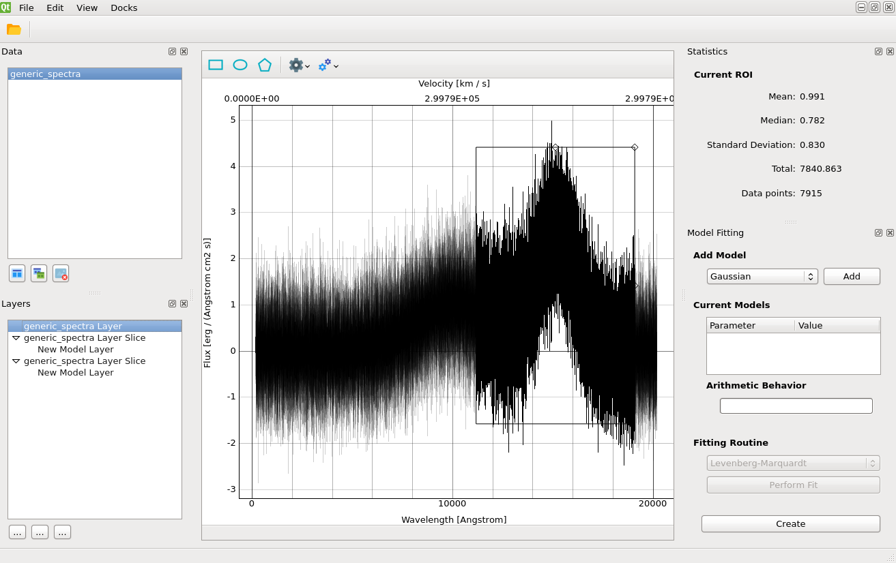

.. _doc_viewer:

Viewer
======

.. note::

    Some buttons and menu options are not functional yet, as this is a work in
    progress.

To open a file:

#. Click on the folder icon on top left or select ``File -> Open`` from menu.
#. Select the desired filename and data type in the file dialog and click
   "Open".
#. The file will be listed under "Data" (top half of left panel).
#. To remove the file from "Data", click on "trash can" icon under "Data".

Once a spectrum is loaded, remember to **click on the plot icon**
(left-most button right above "Layers" at the center of the left panel)
to display the spectrum. It will be plotted in the center display window.
Some basic statistics are shown on top right.
Its data layer will be listed under "Layers" (bottom half of left panel).

If multiple files are opened, each file will have its own plot (overplotting
is not yet supported). To work on the file of interest, click on its plot
window to bring it in focus.

To adjust plot display:

#. If your mouse has center wheel, the wheel can be used to zoom in and out
   while the cursor is over the plot.
#. Click on the "big wheel" icon on top of the plot to change top axis display
   or displayed units.
#. Left click on the plot to bring up a context menu.
#. Select "View All" to view all available data (if zoomed in).
#. Select "X Axis" or "Y Axis" to adjust respective axis behaviors.
#. Select "Mouse Mode" to toggle between 3-button and 1-button mouse.
#. More plot options are available under "Plot Options".
#. Select "Export..." to save plot out as an image.

To select a region of interest (ROI):

#. Select the layer from "Layers" list (if you have multiple).
#. Click on the "rectangle" icon on the top left of the plot. An adjustable
   rectangle will appear on plot display.
#. Click and drag the edges to adjust dispersion coverage. As the region
   changes, basic statistics under "Statistic" on top right of the viewer will
   also update accordingly.
#. Click inside the rectangle and drag to reposition it without resizing.
#. Click the left-most "knife" button under "Layers" (bottom left of the left
   panel) to create a new layer slice from the ROI.
#. To remove a layer slice, select the layer and click on "trash can" button
   under "Layers".
#. To remove ROI, left click while it is highlighted and select "Remove ROI"
   from the context menu.

.. note::

    Layer arithmetic (the "calculator" button under "Layers") is work in
    progress.

To measure equivalent width and related properties:

#. Select the layer from "Layers" list (if you have multiple).
#. Click on the "rectangle with double arrow" icon that is next to the ROI icon
   on the top  left of the plot. Three regions will appear and each can be
   adjusted like an ROI.
#. Position the orange region over the emission or absorption line of interest
   and adjust accordingly.
#. Position each of the green regions over two different continuum areas, one
   on each side of the emission/absorption line.
#. As you adjust the regions, values for equivalent width etc. will be updated
   under the "Measured" tab under "Statistics" on top right of the viewer.

To fit a model to the selected ROI, see :ref:`doc_model_fitting`.

To quit SpecViz, select ``File -> Exit`` from menu.
