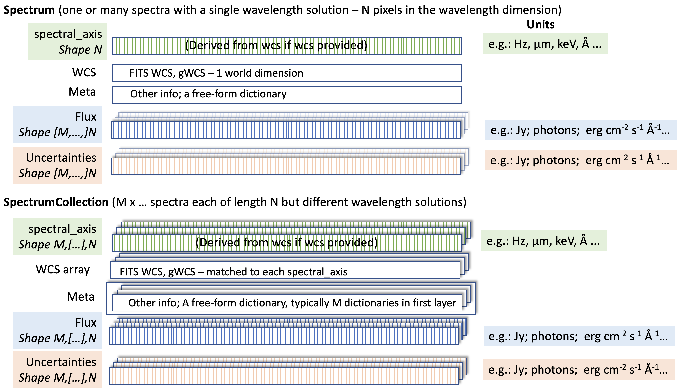

.. currentmodule:: specutils

.. _specutils-representation-overview:

Overview of How Specutils Represents Spectra
--------------------------------------------

The main principle of ``specutils`` is to work as a toolbox.  That is, it aims
to provide the pieces needed to build particular spectroscopic workflows
without imposing a specific *required* set of algorithms or approaches to
spectroscopic analysis.  To that end, it aims to represent several different
types of ways one might wish to represent sets of spectroscopic data in Python.
These objects contains logic to handle multi-dimensional flux data, spectral
axes in various forms (wavelenth, frequency, energy, velocity, etc.), convenient
and unobtrusive wcs support, and uncertainty handling. The core containers also
handle units, a framework for reading and writing from various file formats, and
arithmetic operation support.

The core data objects  are primarily distinguished by the different ways of
storing the flux and the spectral axis . These cases are detailed below, along
with their corresponding ``specutils`` representations:

1. A 1D flux of length ``n``, and a matched spectral axis (which may be
   tabulated as an array, or encoded in a WCS). This is what typically is in
   mind when one speaks of "a single spectrum", and therefore the analysis tools
   are general couched as applying to this case. In ``specutils`` this is
   represented by the `~specutils.Spectrum1D` object with a 1-dimensional
   ``flux``.
2. A set of fluxes that can be represented in an array-like form of shape
   ``n x m (x ...)``,  with a spectral axis strictly of length ``n`` (and a
   matched WCS). In ``specutils`` this is represented by the
   `~specutils.Spectrum1D` object where ``len(flux.shape) > 1`` . In this sense
   the "1D" refers to the spectral axis, *not* the flux. Note that 
   `~specutils.Spectrum1D` subclasses `NDCube <https://github.com/sunpy/ndcube>`_,
   which provideds utilities useful for these sorts of multidimensional fluxes.
3. A set of fluxes  of shape ``n x m (x ...)``, and a set of spectral axes that
   are the same shape. This is distinguished from the above cases because there
   are as many spectral axes as there are spectra.  In this sense it is a
   collection of spectra, so can be thought of as a collection of
   `~specutils.Spectrum1D` objects.  But because it is often more performant to
   store the collection together as just one set of flux and spectral axis
   arrays, this case is represented by a separate object in ``specutils``:
   `~specutils.SpectrumCollection`.
4. An arbitrary collection of fluxes that are not all the same spectral length
   even in the spectral axis direction.  That is, case 3, but "ragged" in the
   sense that not all the spectra are length ``n``.  Because there is no
   performance benefit to be gained from using arrays (because the flux array is
   not rectangular), this case does not have a specific representation in
   ``specutils``.  Instead, this case should be dealt with by making lists (or
   numpy object-arrays) of `~specutils.Spectrum1D` objects, and iterating over
   them.

   Specutils does provide a `SpectrumList` class which is a simple subclass of
   `list` that is integrated with the Astropy IO registry. It enables data
   loaders to read and return multiple heterogenous spectra (see
   :ref:`multiple_spectra`). Users should not need to use `SpectrumList`
   directly since a `list` of `Spectrum1D` objects is sufficient for all other
   purposes.

In all of these cases, the objects have additional attributes (e.g.
uncertainties), along with other metadata.  But the list above is exhaustive
under the assumption that the additional attributes have matched shape to either
flux or spectral axis (or some combination of the two).

As detailed above, these cases are represented in specutils via two classes:
`~specutils.Spectrum1D` (Cases 1 and 2, and indirecly 4) and
`~specutils.SpectrumCollection` (Case 3). A diagram of these data structures is
proved below.

While they all differ in details of how they address specific multidimensional
datasets, these objects all share the core features that they carry a "spectral
axis" and a "flux".  The "spectral axis" (``Spectrum*.spectral_axis``) is the physical
interpretation for each pixel (the "world coordinate" in WCS language). For
astronomical spectra this is usually wavelength, frequency, or photon energy,
although for un-calibrated spectra it may simply be in pixel units. The "flux"
(``Spectrum*.flux``) is the spectrum itself - while the name "flux" may seem to imply a
specific unit, in fact the ``flux`` can carry any unit - actual flux, surface
brightness in magnitudes, or counts.  However, the best form for representing
*calibrated* spectra is spectral flux density (power per area per spectral
spectral axis unit), and the analysis tools often work best if a spectrum is in
those units.
