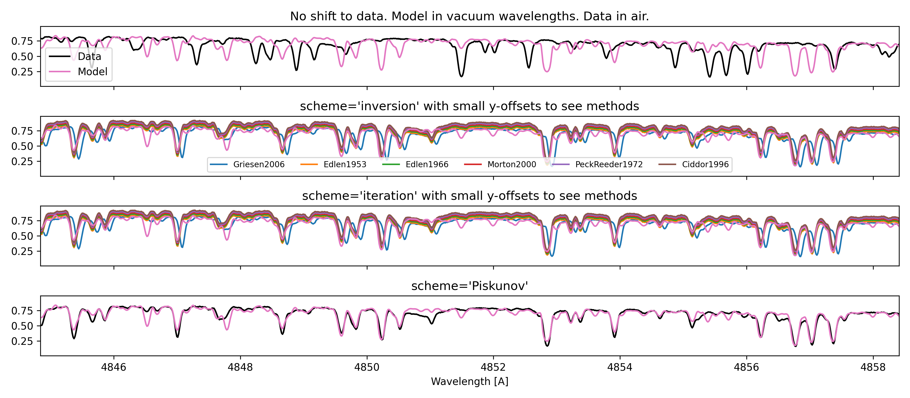
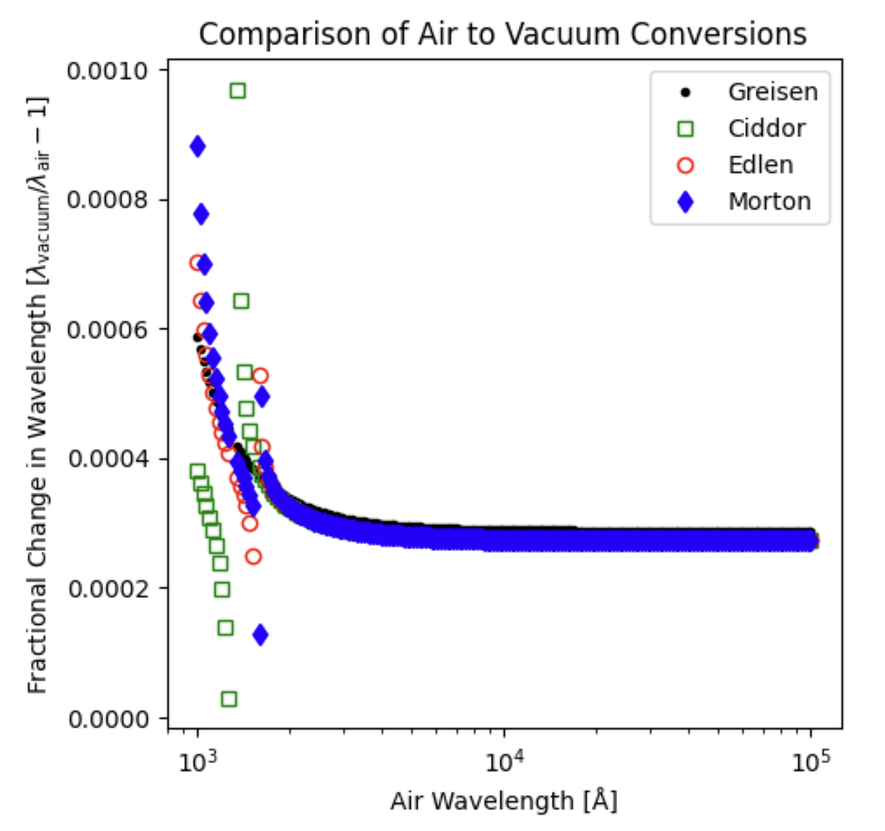

=============
WCS Utilities
=============

The `~specutils.utils.wcs_utils` module has functions for converting spectral values
between air and vacuum, as well as a function for calculating the refractive index
of air, which is used in the air to vacuum conversions. There are multiple methods
available for the refractive index calculation, most of which agree with each other
to a high level of precision. However, the Griesen (2006) equation seems to have a small
offset from the others of about 0.07 Angstrom (at the wavelengths shown in the plot below)
and thus in specutils 1.17.0 we have changed from using that method as the default to
using the Morton (2000) equation by default, which is consistent with the IAU standard.

The downside of all methods but Griesen (2006) is that they have mathematical singularities
in the far UV, and thus are only valid at wavelengths longer than 200 nm. The specutils
conversion functions will raise an error if these methods are used for wavelengths shorter
than this limit.

For additional context and discussion, see https://github.com/astropy/specutils/issues/1162.

Reference/API
-------------
.. automodapi:: specutils.utils.wcs_utils
    :no-heading:

    :skip: GWCS
    :skip: Shift
    :skip: Tabular1D
    :skip: SpectralGWCS
